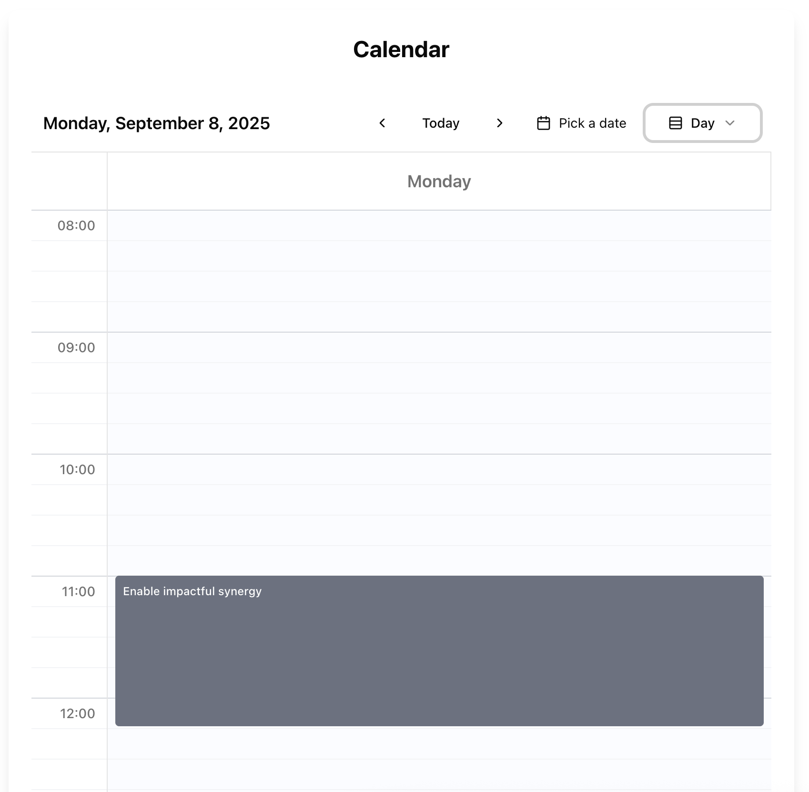

# Calendar Component for Shadcn UI

An extended calendar component built on top of Shadcn UI components with day, week, and month views. Features drag-and-drop event resizing, mobile-responsive design, and customizable time slots.

## Prerequisites

This component requires the following dependencies to be installed in your project:

- date-fns
- jotai
- lucide-react

## Installation

### 1. Install Shadcn UI (if not already installed)

If you haven't set up Shadcn UI in your project yet:

```bash
npx shadcn-ui@latest init
```

### 2. Install required Shadcn UI components

```bash
npx shadcn-ui@latest add button calendar dropdown-menu popover
```

### 3. Copy the calendar component files

Copy the following files to your project:

- `components/calendar.jsx` - The main calendar component
- `components/ui/shadcn-io/calendar/index.jsx` - The extended calendar UI component

### 4. Import and use the component

## Usage

### Basic Example

```jsx
import { useState } from 'react';
import { Calendar } from '@/components/calendar';

function MyCalendar() {
  const [events, setEvents] = useState([
    {
      id: "1",
      name: "Team Meeting",
      startAt: "2024-01-15T10:00:00Z",
      endAt: "2024-01-15T11:00:00Z",
      status: { 
        id: "planned", 
        name: "Planned", 
        color: "#3B82F6" 
      }
    }
  ]);

  return (
    <Calendar
      events={events}
      onDayClick={handleDayClick}
      onTimeSlotClick={handleTimeSlotClick}
      onEventClick={handleEventClick}
      startTime="08:00"
      endTime="20:00"
      interval={15}
      disabledDays={[0, 6]} // Disable weekends
    />
  );
}
```

## Props

| Prop | Type | Default | Description |
|------|------|---------|-------------|
| `events` | `Array<CalendarEvent>` | `[]` | Array of calendar events to display |
| `onDayClick` | `(day: number, month: number, year: number) => void` | - | Callback when a day is clicked |
| `onTimeSlotClick` | `(date: Date, timeSlot: object) => void` | - | Callback when a time slot is clicked |
| `onEventClick` | `(event: CalendarEvent) => void` | - | Callback when an event is clicked |
| `startTime` | `string` | `"08:00"` | Start time for the calendar (24-hour format) |
| `endTime` | `string` | `"20:00"` | End time for the calendar (24-hour format) |
| `interval` | `number` | `15` | Time slot interval in minutes |
| `disabledDays` | `Array<number>` | `[]` | Days to disable (0=Sunday, 1=Monday, etc.) |

## Event Structure

Events must follow this structure:

```typescript
interface CalendarEvent {
  id: string;                    // Unique identifier for the event
  name: string;                  // Event title/name
  startAt: string;              // ISO 8601 datetime string (e.g., "2024-01-15T10:00:00Z")
  endAt: string;                // ISO 8601 datetime string (e.g., "2024-01-15T11:00:00Z")
  status: {                     // Event status/type
    id: string;                 // Status identifier
    name: string;               // Status display name
    color: string;              // Hex color code (e.g., "#3B82F6")
  };
}
```

### Example Event

```javascript
const exampleEvent = {
  id: "c6f7b6b1-6f54-4f91-b184-55c7dfcc1e91",
  name: "Project Review Meeting",
  startAt: "2024-01-15T14:30:00Z",
  endAt: "2024-01-15T15:30:00Z",
  status: { 
    id: "planned", 
    name: "Planned", 
    color: "#10B981" 
  }
};
```

## Event Handlers

### onDayClick

Called when a user clicks on a day in the calendar.

```javascript
const handleDayClick = (day, month, year) => {
  const monthNames = [
    'January', 'February', 'March', 'April', 'May', 'June',
    'July', 'August', 'September', 'October', 'November', 'December'
  ];
  console.log(`Clicked on day: ${day} ${monthNames[month]} ${year}`);
  
  // Example: Open a modal to create a new event
  // setSelectedDate(new Date(year, month, day));
  // setShowEventModal(true);
};
```

### onTimeSlotClick

Called when a user clicks on a specific time slot.

```javascript
const handleTimeSlotClick = (date, timeSlot) => {
  console.log(`Clicked on ${date.toDateString()} at ${timeSlot.time}`);
  
  // Example: Create a new event at this time
  // const newEvent = {
  //   id: generateId(),
  //   name: "New Event",
  //   startAt: timeSlot.startTime,
  //   endAt: timeSlot.endTime,
  //   status: defaultStatus
  // };
  // setEvents(prev => [...prev, newEvent]);
};
```

### onEventClick

Called when a user clicks on an existing event.

```javascript
const handleEventClick = (calEvent) => {
  console.log(`Clicked on event: ${calEvent.name} (${calEvent.status.name})`);
  console.log(`Event details:`, calEvent);
  
  // Example: Open event details modal
  // setSelectedEvent(calEvent);
  // setShowEventDetails(true);
};
```


## Examples

Here are screenshots showing the calendar in different views:

<div align="center">

| Month View | Week View |
|------------|-----------|
|  |  |
| **Day View** | **Mobile View** |
|  |  |

</div>

## Features

- 📅 **Multiple Views**: Day, week, and month views
- 📱 **Mobile Responsive**: Automatically adapts to mobile devices
- 🎨 **Customizable**: Full control over styling through Shadcn UI
- ⏰ **Time Slots**: Configurable time intervals and working hours
- 🚫 **Disabled Days**: Exclude specific days (e.g., weekends)
- 🖱️ **Interactive**: Click handlers for days, time slots, and events
- 🎯 **Event Status**: Support for different event types with colors

## Styling

The component uses Tailwind CSS classes and integrates seamlessly with Shadcn UI's design system. All styling is handled through the Shadcn UI components, and assumes they live in @/components/ui/.

## License

ISC